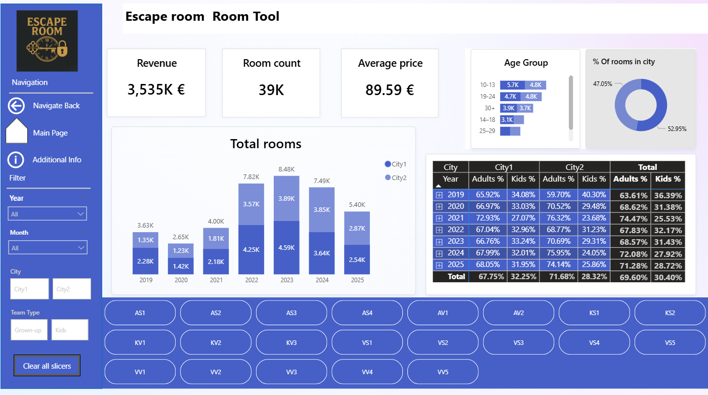
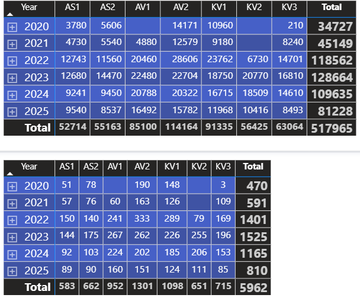
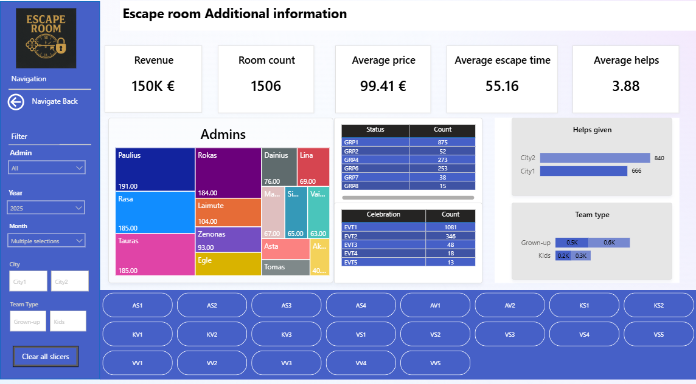

# Escape Room Data Analysis Project

### Project Description
This project analyzes escape room performance using synthetized and anonymized data.
Original data was extracted and clean and concept was required for dashboards created for real escape roooms.
Although the data does not represent real values, the analytical logic and insights reflect realistic business scenarios.  
The dataset covers the years **2019–2025**.

---

### Project Structure
```
escape-room-etl-and-insights/
│
├── data/
├─────├── data_example.png // short example in png format
├──   └── full_data.csv   //example of final data, ready for Power BI analysis
│
│   ├── EscapeRoom_Dashboard.pbix
│   └── screenshots/
│       ├── anonymize_and_synthesize.py     // Masks anonymize and sythesize data for publicity
│       ├── data_cleaning_city1.py          // Standartize, clean, categorize city1 data into seperate full data csv 
│       ├── data_cleaning_city2.py         //  Standartize, clean, categorize city2 data into seperate full data csv      
        ├── data_merge.py                  // Merges seperate month csvs to yearly CSVs
        ├── extract_sheets_to_csv.py      //Extracts xlsx sheets to seperate CSV files
│       └── full_data.py                   //Merges cleaned city1 and city2 data
├── insights/
│   └── additional .png dashboards
├── powerbi/
│   ├── EscapeRoom_Dashboard.pbix
│   └── screenshots/
│       ├── 01_main_dashboard.png
│       ├── 02_room_analysis.png
│       ├── 03_revenue_by_room.png
│       └── 04_admin_leaderboard.png
│
├── README.md
├── LICENSE
└── .gitignore
```

---

### Data Sources
The project uses synthetic copies of real escape room data.  
Source files originated from multiple Excel sheets with differing structures for different cities.

---

### Data Cleaning and Preparation

**Goal:**  
Prepare and standardize escape room data from cities, ensuring consistency across years and cities.

---

### Task 1: Extract Excel Data
**Goal:**  
Export all Excel sheets into separate CSV files.

**Process:**  
- Each Excel sheet exported as an individual CSV file (one sheet → one file).  
- Files merged according to sheet names to produce complete yearly datasets.  
- Column name inconsistencies fixed automatically during processing.  
- Manual validation performed to ensure no missing or corrupted data.

---

### Task 2: Cleaning Files With Different Structures
**Goal:**  
Handle structural differences between cities source files and unify schemas.

**Process:**  
- Apply separate cleaning pipelines for each city.  
- Standardize column names, formats, and data types.  
- Ensure both city datasets follow a consistent schema.

---

### Task 3: Core Cleaning Rules
**Goal:**  
Normalize data values and enforce consistent business rules.

**Process:**  
- Set **default prices** according to booking period.  
- Collapse **team size groups** to 8 categories.  
- Collapse **celebration groups** to 5 categories.  
- Collapse **source groups** from to 6 categories.  
- Standardize **room names** using a mapping table.  
- Apply **regex** for text cleanup and normalization.  
- Round start times to one of six predefined **casual time slots**.  
- Normalize prices using regex and fill missing or merged entries with defaults.  
- Parse escape times with `pandas.to_timedelta` and convert to total minutes. Invalid/missing values flagged.

---

### Task 4: Feature Engineering
**Goal:**  
Add derived columns to enhance analysis.

**Process:**  
- **AgeGroup:** derived from seven age-related columns → 7-level category.  
- **TeamType:** calculated from AgeGroup and room type.  
- Missing age groups filled according to room type rules.

---

### Task 5: Process File Function
**Goal:**  
Apply full data cleaning and standardization pipeline to each CSV.

**Function Responsibilities:**  
- Read raw CSV  
- Extract year from filename (using regex)  
- Remove duplicates and invalid rows  
- Standardize room names  
- Clean text fields using regex  
- Normalize prices, times, and escape durations  
- Build AgeGroup and TeamType columns  
- Round start times to casual slots  
- Reorder columns into final schema  
- Export cleaned CSV  

**Outputs:**  
- `clean_city1.csv`  
- `clean_city2.csv`

---

### Task 6: Data Merging
**Goal:**  
Combine cleaned cities datasets into a single unified CSV.

**Process:**  
- Align column names and formats  
- Standardize prices, escape times, and source groups  
- Remove rare or inconsistent values  
- Merge datasets into one ready-to-use CSV for analysis and dashboards

**Final Output:**  


escape_rooms_2019_2025.csv

---

### Power BI Analysis

**Goal:**  
Provide insights to support further growth of Escape rooms.

---

### Kids vs Grown Ups  
**Data explored:** 2019–2025  

**Findings:**  



- The dominant age group is **10–13 years old**, indicating the need for escape rooms specifically designed for this segment.  
- **City 1** maintains a stable flow of approximately **32% kids** from total clients.  
- **City 2** shows inconsistent performance with **3–6% yearly variation** in kid-room demand compared to City 1.


These findings indicate a clear market opportunity for expanding offerings targeted at ages 10–13.

---

### Profitability and ROI

Based on the age group insights, the decision was made that future business growth requires a room designed for ages **10–13** in **City 2**.

Internal cost analyses (not included in the synthetic dataset but used for business decisions) indicated that the most profitable and quickest new room to establish would be **AV2**.



**Notes:**  
- AV1 already exists in City2.  
- AV2 offers the best balance between setup cost, build duration, and estimated demand.

**Next Steps:**  
Planning is underway for additional rooms targeted at ages 10–13 in City 2.

---

### Administrator Reward System  
**Period analyzed:** October 2025  

Retention and customer satisfaction improve significantly with high-quality administrative work.  
To support this, a monthly administrator reward program will be introduced.



**Evaluation Metrics:**  
- **Room Count:** More rooms handled results in a higher score.  
- **Average Price:** Higher revenue per booking (larger groups) increases the score.  
- **Average Escape Time:** Extremely short escape times may indicate rushed service.  
- **Average Number of Hints:** Too many hints may suggest poor room management.

Administrators with the highest combined performance score will receive monthly recognition and incentives.

---

### City 1 – Room Development Opportunities  
**Data explored:** 2022–2025  

**Key Insights:**  
- **AS4** is the best-performing room with **779 entries (2025 YTD)**.  
- City 1 will open a new adult-oriented room modeled on AS4’s successful theme.  
- A concept from **City 2 (VS4)** with **356 entries (2025 YTD)** will be adapted for another new room in City 1.


Insights are a part of growth program of Escape rooms.

### License
Synthetic data used only for educational and analytical purposes.  
See `LICENSE` for details.
